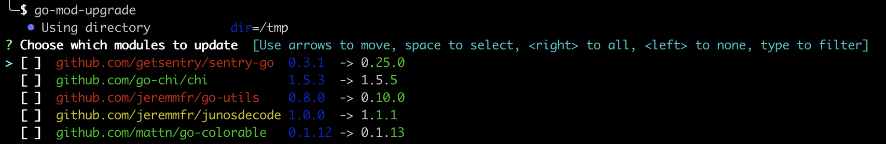

# go-mod-upgrade

[](/license)
[](https://github.com/jeremmfr/go-mod-upgrade/releases/latest)

> Update outdated Go dependencies interactively



## Why

The Go wiki has a great section on [How to Upgrade and Downgrade Dependencies](https://github.com/golang/go/wiki/Modules#how-to-upgrade-and-downgrade-dependencies).
One can run the command

```bash
go list -e -u -f '{{if (and (not (or .Main .Indirect)) .Update)}}{{.Path}}: {{.Version}} -> {{.Update.Version}}{{end}}' -m all 2> /dev/null
```

to view available upgrades for direct dependencies.
Unfortunately, the output is not actionable, i.e. we can't easily use it to update multiple dependencies.

This tool is an attempt to make it easier to update multiple dependencies interactively.
This is similar to [yarn upgrade-interactive](https://legacy.yarnpkg.com/en/docs/cli/upgrade-interactive/), but for Go.

## Install

Pre-compiled binaries for Windows, OS X and Linux are available in the [releases page](https://github.com/jeremmfr/go-mod-upgrade/releases).

Alternatively, with the Go toolchain, you can do

```bash
go install github.com/jeremmfr/go-mod-upgrade@latest
```

## Usage

In a Go project which uses modules, you can now run

```bash
go-mod-upgrade
```

Colors in module names help identify the update type:

* green for a patch update
* yellow for a minor update
* red for :
  * major update
  * minor update with major `v0`
  * prerelease update

## Help

```bash
$ go-mod-upgrade --help
NAME:
   go-mod-upgrade - Update outdated Go dependencies interactively

USAGE:
   go-mod-upgrade [global options] command [command options] [arguments...]

VERSION:
   ...

COMMANDS:
   help, h  Shows a list of commands or help for one command

GLOBAL OPTIONS:
   --pagesize value, -p value  Specify page size (default: 10)
   --force, -f                 Force update all modules in non-interactive mode (default: false)
   --tidy, -t                  Run go mod tidy after update (default: false)
   --verbose, -v               Verbose mode (default: false)
   --hook value                Hook to execute for each updated module
   --help, -h                  show help
   --version                   print the version (default: false)
```
